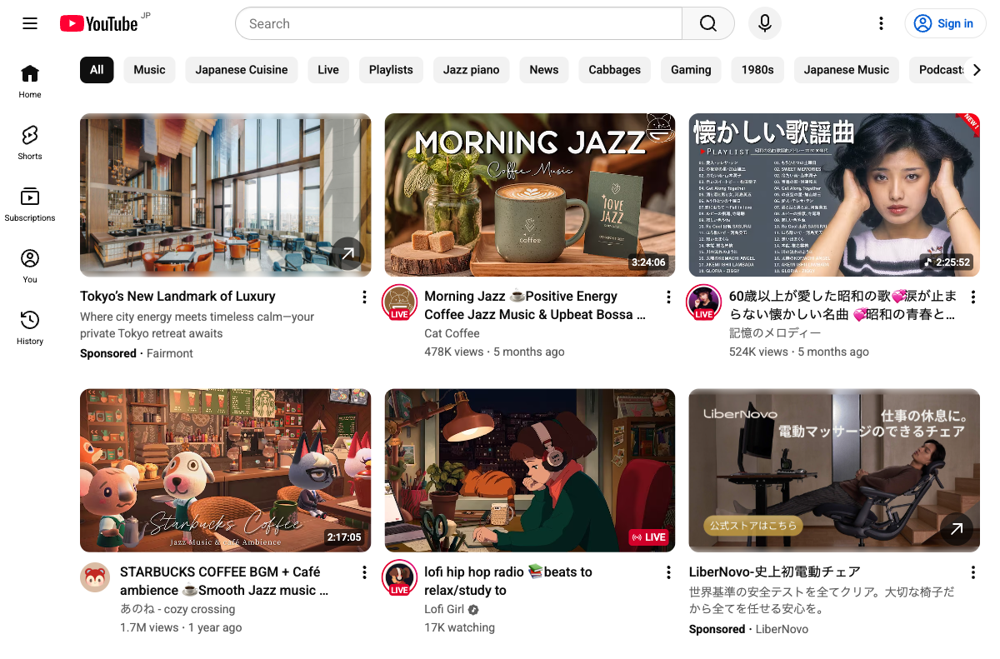
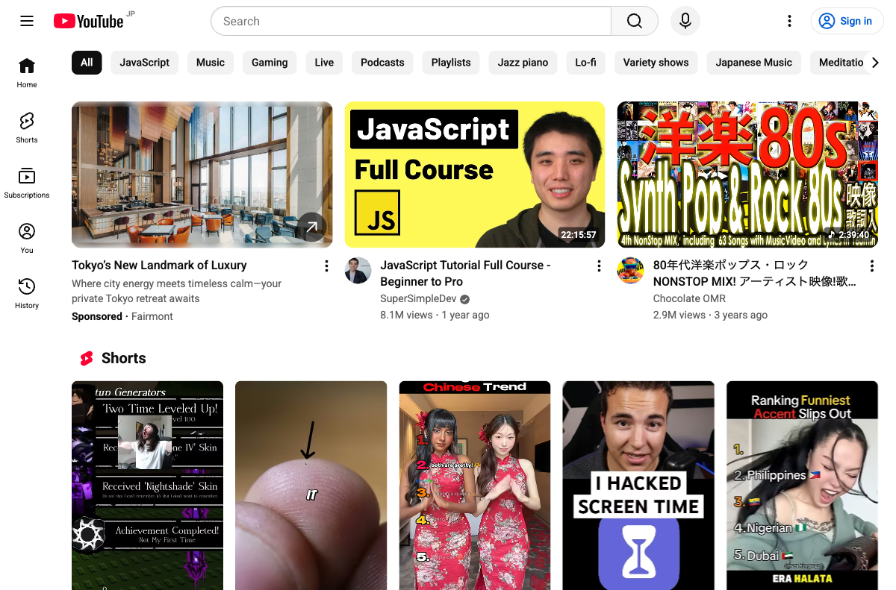
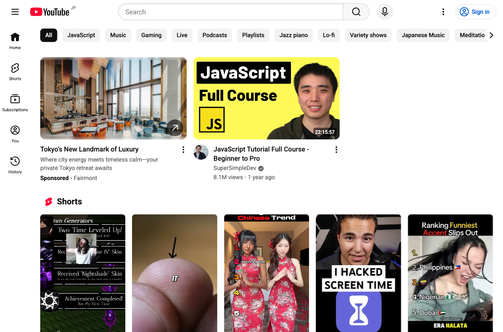
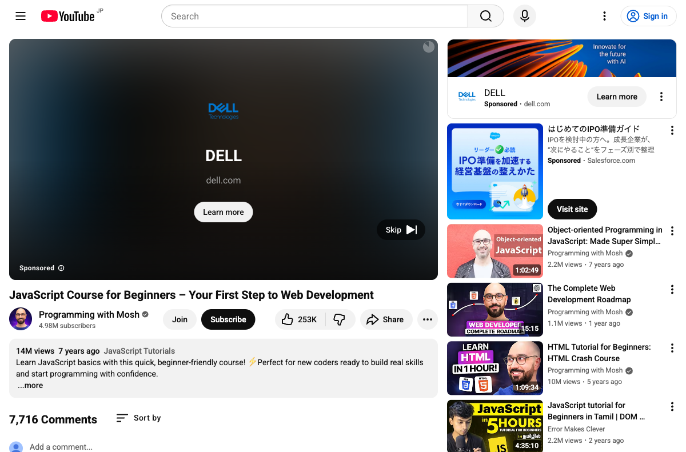

# YouTube Home Filter

[](https://opensource.org/licenses/MIT)
[](https://developer.chrome.com/docs/extensions/)

A Chrome extension that filters YouTube videos by **view count** and **publish date**. Hide low-quality or outdated content to focus on what matters.

## Features

- **View Count Filter** - Set minimum/maximum view thresholds to hide unpopular or overly viral videos
- **Publish Date Filter** - Hide videos older than a specified number of days
- **Filter Modes** - Choose between "Any" (OR) and "All" (AND) logic for combining filters
- **Multi-language Support** - Parses English and Japanese YouTube metadata (e.g., "1.2M views", "100万 回視聴")
- **Real-time Filtering** - Videos are filtered as they load, including infinite scroll and SPA navigation
- **FOUC Prevention** - Videos are hidden until filtering completes, so filtered content never flashes on screen
- **Works Everywhere on YouTube** - Home page, search results, sidebar recommendations, and channel pages

## Screenshots

### Before filtering (YouTube Home)


### After filtering by view count (min 5M views)


### Visual comparison - filtered videos highlighted


### Search results filtered by publish date (past year)


### Sidebar recommendations filtered


## Installation

Since this extension is not published on the Chrome Web Store, you can install it manually:

1. Clone or download this repository:
   ```bash
   git clone https://github.com/threecorp/youtube-video-filter.git
   ```

2. Open Chrome and navigate to `chrome://extensions/`

3. Enable **Developer mode** (toggle in the top-right corner)

4. Click **Load unpacked** and select the cloned directory

5. The extension icon will appear in your toolbar. Click it to configure filters.

## Usage

1. Click the extension icon in Chrome's toolbar
2. Toggle the **global switch** to enable/disable filtering
3. Enable **View Count Filter** and set minimum/maximum thresholds
4. Enable **Publish Date Filter** and set maximum days since published
5. Choose a filter mode:
   - **Any** (default): Video is hidden if ANY enabled filter condition is not met
   - **All**: Video is hidden only if ALL enabled filter conditions are not met

Settings are saved automatically and synced across your Chrome devices.

## How It Works

The extension uses a content script that:

1. Observes YouTube's DOM for video elements (`ytd-rich-item-renderer`, `ytd-video-renderer`, `yt-lockup-view-model`)
2. Extracts view count and publish date from each video's metadata
3. Applies filter rules based on your settings
4. Hides or shows videos using CSS `data-yt-filtered` attributes
5. Listens for YouTube's SPA navigation events to re-filter on page transitions

## Project Structure

```
youtube-video-filter/
├── manifest.json      # Chrome Extension manifest (Manifest V3)
├── background.js      # Service worker for cross-tab settings sync
├── content.js         # Main filtering logic injected into YouTube
├── content.css        # FOUC prevention and hide/show styles
├── popup.html         # Extension popup UI
├── popup.js           # Popup logic and settings management
├── popup.css          # Popup styles
├── icons/             # Extension icons (16, 48, 128px)
└── docs/screenshots/  # Documentation screenshots
```

## License

[MIT](LICENSE)
